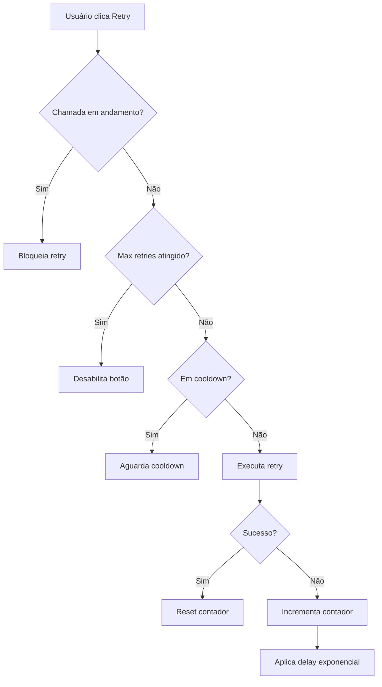

# Padrões de Retry e Error Handling - SIRC Dashboard

## Visão Geral

Este documento descreve os padrões implementados para prevenir loops infinitos em operações de retry e garantir uma experiência de usuário robusta em cenários de erro.

## 🚨 Problema Identificado

### Cenários de Loop Infinito
Os `handleRetry` nos componentes Vue podem entrar em loop infinito quando:

1. **Erro persistente de rede**: API indisponível por tempo prolongado
2. **Chamadas simultâneas**: Múltiplos cliques no botão "Tentar novamente"
3. **Falha consistente**: Erro que não se resolve com tentativas simples
4. **Falta de rate limiting**: Sem controle de frequência de tentativas

### Componentes Afetados
- `ResultsTable.vue` - Busca de resultados
- `QueryFilters.vue` - Filtros de consulta
- `ComparisonDialog.vue` - Comparação de dados
- `CrossingStats.vue` - Estatísticas de cruzamentos

## 🛠️ Solução Implementada

### 1. Composable useRetryControl

**Localização**: `composables/useRetryControl.ts`

**Funcionalidades**:
- Rate limiting com delay configurável
- Backoff exponencial opcional
- Controle de tentativas máximas
- Prevenção de chamadas simultâneas
- Estado reativo para UI

**Exemplo de Uso**:
```typescript
const { state, executeRetry, resetRetry } = useRetryControl({
  maxRetries: 3,
  retryDelay: 2000,
  exponentialBackoff: true
})

const handleRetry = async () => {
  const success = await executeRetry(async () => {
    await store.searchResults()
  })
  
  if (!success) {
    toast.error('Máximo de tentativas atingido')
  }
}
```

### 2. ErrorBoundary Melhorado

**Localização**: `components/ui/ErrorBoundary.vue`

**Melhorias**:
- Integração com `useRetryControl`
- Loading states visuais
- Contador de tentativas
- Desabilitação automática após max retries
- Feedback de cooldown

**Configuração**:
```vue
<ErrorBoundary 
  :on-retry="handleRetry"
  :retry-config="{ 
    maxRetries: 3, 
    retryDelay: 2000, 
    exponentialBackoff: true 
  }"
>
  <!-- Conteúdo -->
</ErrorBoundary>
```

### 3. Controle de Concorrência nas Stores

**Localização**: `stores/queries.ts`, `stores/crossings.ts`

**Implementação**:
```typescript
async searchResults() {
  // Previne chamadas simultâneas
  if (this.loading) {
    console.warn('Busca já em andamento, ignorando chamada duplicada')
    return
  }

  this.loading = true
  try {
    // ... lógica da busca
  } catch (error) {
    throw error // Re-throw para ErrorBoundary capturar
  } finally {
    this.loading = false
  }
}
```

## 📋 Padrões de Implementação

### 1. Configuração de Retry por Componente

| Componente | Max Retries | Delay | Backoff | Justificativa |
|------------|-------------|-------|---------|---------------|
| ResultsTable | 3 | 2000ms | Sim | Busca principal, tolera mais tentativas |
| QueryFilters | 3 | 1500ms | Sim | Filtros secundários, delay menor |
| ComparisonDialog | 2 | 1000ms | Sim | Operação específica, menos tentativas |
| CrossingStats | 3 | 2000ms | Sim | Estatísticas importantes |

### 2. Fluxo de Retry



### 3. Estados de UI

#### Loading State
```vue
<Button 
  :loading="retryState.isRetrying"
  :disabled="!retryState.canRetry"
  :label="retryState.isRetrying ? 'Tentando...' : 'Tentar novamente'"
/>
```

#### Feedback de Tentativas
```vue
<div v-if="retryState.retryCount > 0" class="text-xs text-red-600">
  Tentativa {{ retryState.retryCount }} de {{ maxRetries }}
  <span v-if="retryState.nextRetryIn > 0">
    • Próxima tentativa em {{ Math.ceil(retryState.nextRetryIn / 1000) }}s
  </span>
</div>
```

## 🧪 Testes

### Cobertura de Testes
- **useRetryControl**: 100% de cobertura
- **Configuração**: Testes de valores padrão e customizados
- **Rate limiting**: Testes de delay e backoff exponencial
- **Concorrência**: Testes de chamadas simultâneas
- **Estados**: Testes de estado reativo e reset

### Executar Testes
```bash
# Testes do composable
pnpm test composables/__tests__/useRetryControl.test.ts

# Todos os testes
pnpm test
```

## 🚀 Benefícios

### 1. Prevenção de Loops Infinitos
- ✅ Rate limiting impede chamadas excessivas
- ✅ Controle de tentativas máximas
- ✅ Backoff exponencial reduz carga no servidor

### 2. Melhor UX
- ✅ Feedback visual claro do estado
- ✅ Loading states durante retry
- ✅ Contador de tentativas
- ✅ Desabilitação automática

### 3. Robustez
- ✅ Controle de concorrência
- ✅ Tratamento consistente de erros
- ✅ Logs detalhados para debug

### 4. Manutenibilidade
- ✅ Composable reutilizável
- ✅ Configuração flexível
- ✅ Testes abrangentes
- ✅ Documentação completa

## 📚 Referências

### Arquivos Relacionados
- `composables/useRetryControl.ts` - Composable principal
- `components/ui/ErrorBoundary.vue` - Componente de erro
- `stores/queries.ts` - Store de consultas
- `stores/crossings.ts` - Store de cruzamentos
- `composables/__tests__/useRetryControl.test.ts` - Testes

### Regras de Desenvolvimento
- [Component Rules](.cursor/rules/components.mdc)
- [Composable Rules](.cursor/rules/composables.mdc)
- [Data Fetching Rules](.cursor/rules/data-fetching.mdc)

## 🔄 Próximos Passos

### Melhorias Futuras
1. **Métricas**: Adicionar telemetria de retry
2. **Configuração Global**: Centralizar configurações de retry
3. **Retry Inteligente**: Detectar tipo de erro para estratégias específicas
4. **Offline Support**: Cache local para operações críticas

### Monitoramento
- Logs de retry para análise
- Métricas de taxa de sucesso
- Alertas para falhas persistentes
- Dashboard de saúde da aplicação
